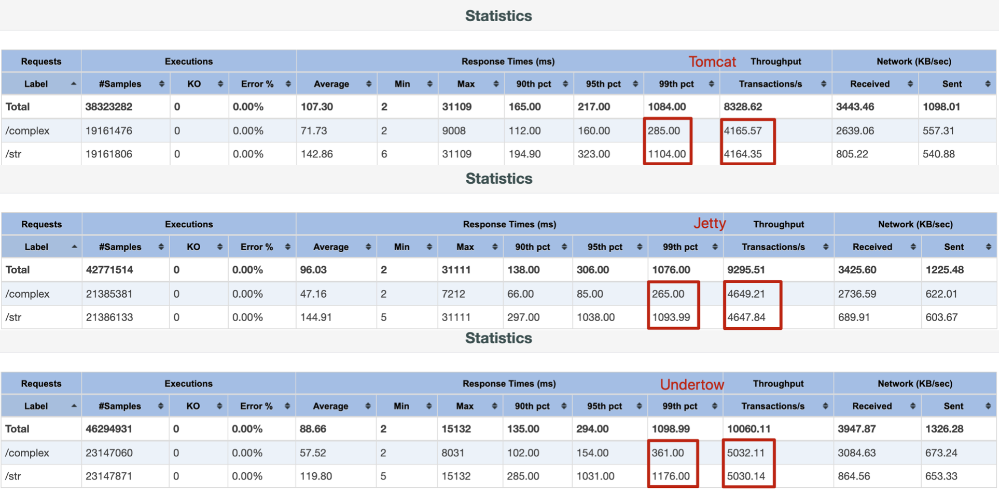
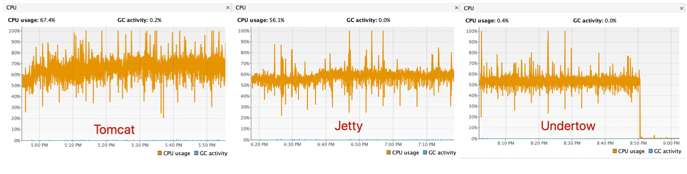
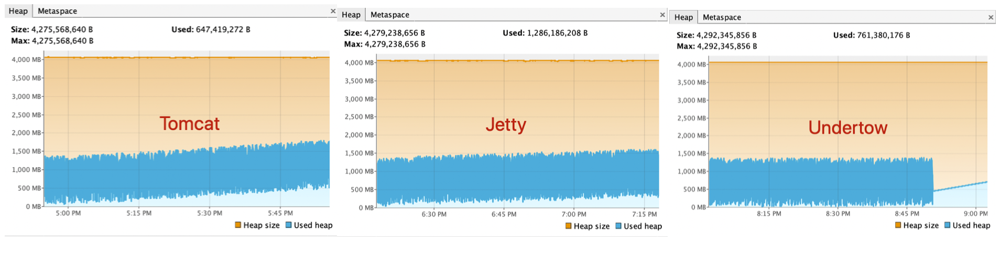
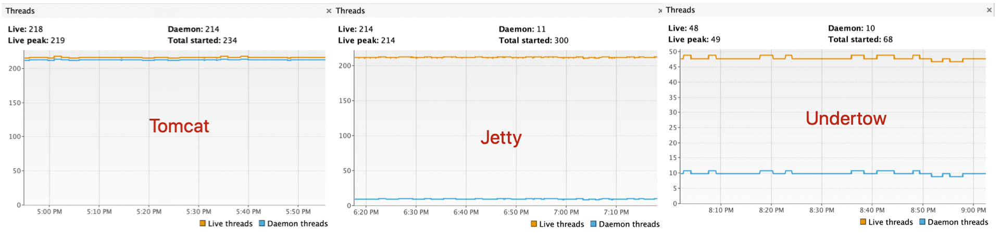

Tomcat，Jetty和Undertow是目前比较主流的3款Servlet容器，而且Spring Boot框架还提供了对它们的集成支持（默认使用的是Tomcat），网络上有许多文章都在介绍Undertow容器的性能比Tomcat和Jetty要好。本着事实就是的原则，我对这三款容器做了一个压测对比，真正通数据来对比到底是谁有优势，同时也是作为容器选择的一个参考。

## 测试环境

1. 压测工具：JMeter 5.2.1，使用插件jpgc-casutg提供的Concurrency Thread Group线程组对象
2. 测试程序：一个简单的基于Spring Boot框架程序，提供2个接口，分别模拟返回简单字符串对象和复杂对象，详见：https://gitee.com/cchanghui/test-servlet-container.git
3. 测试用例：分别使用100个线程，500个线程，1000个线程三组压力进行测试
4. 压测环境：
   - 操作系统：Ubuntu 18.04 LTS Desktop
   - 处理器：Intel® Core™ i5-6200U CPU @ 2.30GHz × 4
   - 内存：8GB
5. 压测主要指标：响应时间，吞吐量，系统负载（CPU，内存，线程数）

## 压测指标

1.吞吐量及响应时间
吞吐量：Undertow > Jetty > Tomcat
响应时间：Jetty < Tomcat < Undertow

2.CPU使用率：Undertow < Jetty < Tomcat

3.内存使用率：Undertow < Jetty < Tomcat

4.线程数：Undertow < Jetty < Tomcat

## 结论

结论：综合吞吐量，响应时间以及资源消耗，Undertow胜出。

作者：[编程随笔](http://www.cnblogs.com/nuccch/)
出处：http://www.cnblogs.com/nuccch/
声明：本文版权归作者和博客园共有，欢迎转载，但请在文章页面明显位置给出原文连接。

分类: [Web](https://www.cnblogs.com/nuccch/category/1070207.html)