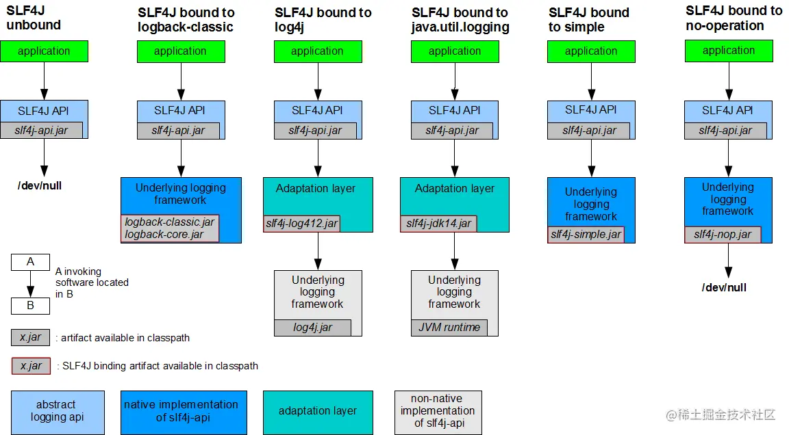
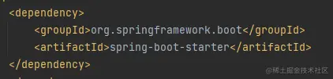
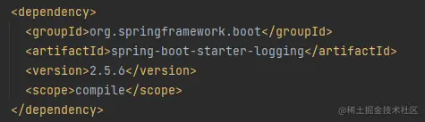
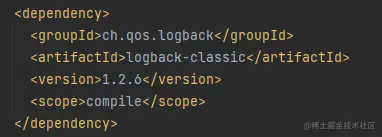
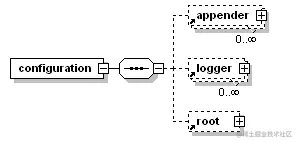
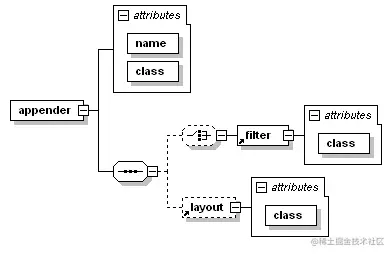

# SLF4J,Logback,Log4j之间的联系和区别及Logback的使用

[Verge_](https://juejin.cn/user/1486954065575166/posts)

2021-11-20 21:521364

## SLF4J,Logback,Commons Logging,Log4j之间的联系和区别

Simple Logging Facade for Java（SLF4J）简单日志门面

从名字可以看出来它用到了门面模式

门面模式，也叫外观模式，英文全称是 Facade Design Pattern

在 GoF 的《设计模式》一书中，门面模式是这样定义的：

> Provide a unified interface to a set of interfaces in a subsystem.
>
> Facade Pattern defines a higher-level interface that makes the subsystem easier to use.

门面模式为子系统提供一组统一的接口，定义一组高层接口让子系统更易用。

门面模式定义中的“子系统（subsystem）”也可以有多种理解方式。它既可以是一个完整的系统，也可以是更细粒度的类或者模块。

这里提到的接口指的不是Java中的Interface，我的理解是下层对外层或内层对外层提供的服务

不难理解SLF4J不是具体的日志解决方案，只是服务于各种日志框架



此图展示了SLF4J绑定其他日志组件的说明

从图中可以看出，SLF4J在Logback,Commons Logging,Log4j等日志框架上又封装了一层，在写代码时直接调用SLF4J的api，在实际运行时可以随时切换底层框架的，而不用改动代码。JDBC也使用了相同的模式。

## Logback

这里详细介绍一下Logback

对于Spring Boot项目来说，在



依赖的

 的



中已经引入了logback，不需要在在pom里面配置了

官方文档中对于logbook自动配置的说明

> Let us begin by discussing the initialization steps that logback follows to try to configure itself:

> 1. Logback tries to find a file called *logback-test.xml* [in the classpath](https://link.juejin.cn/?target=http%3A%2F%2Flogback.qos.ch%2Ffaq.html%23configFileLocation).
> 2. If no such file is found, logback tries to find a file called *logback.groovy* [in the classpath](https://link.juejin.cn/?target=http%3A%2F%2Flogback.qos.ch%2Ffaq.html%23configFileLocation).
> 3. If no such file is found, it checks for the file *logback.xml* [in the classpath](https://link.juejin.cn/?target=http%3A%2F%2Flogback.qos.ch%2Ffaq.html%23configFileLocation)..
> 4. If no such file is found, [service-provider loading facility](https://link.juejin.cn/?target=http%3A%2F%2Fdocs.oracle.com%2Fjavase%2F6%2Fdocs%2Fapi%2Fjava%2Futil%2FServiceLoader.html) (introduced in JDK 1.6) is used to resolve the implementation of [`com.qos.logback.classic.spi.Configurator`](https://link.juejin.cn/?target=http%3A%2F%2Flogback.qos.ch%2Fxref%2Fch%2Fqos%2Flogback%2Fclassic%2Fspi%2FConfigurator.html) interface by looking up the file *META-INF\services\ch.qos.logback.classic.spi.Configurator* in the class path. Its contents should specify the fully qualified class name of the desired `Configurator` implementation.
> 5. If none of the above succeeds, logback configures itself automatically using the [`BasicConfigurator`](https://link.juejin.cn/?target=http%3A%2F%2Flogback.qos.ch%2Fxref%2Fch%2Fqos%2Flogback%2Fclassic%2FBasicConfigurator.html) which will cause logging output to be directed to the console.

大概意思就是logback首先在classpath中寻找`logback-test.xml`，没找到就找`logback.groovy`，还没找到就找`logback.xml`，还没找到就用JDK的`service-provider`在`META-INF\services\ch.qos.logback.classic.spi.Configurator`中寻找`com.qos.logback.classic.spi.Configurator`的实现类，要是还没有就用自己的BasicConfigurator进行配置

```xml
xml复制代码<configuration>

  <appender name="STDOUT" class="ch.qos.logback.core.ConsoleAppender">
    <!-- encoders are assigned the type
         ch.qos.logback.classic.encoder.PatternLayoutEncoder by default -->
    <encoder>
      <pattern>%d{HH:mm:ss.SSS} [%thread] %-5level %logger{36} - %msg%n</pattern>
    </encoder>
  </appender>

  <root level="debug">
    <appender-ref ref="STDOUT" />
  </root>
</configuration>
```

这个就和BasicConfigurator配出来的效果一样

接下来说一下Logback的配置文件

### Logback配置文件

configuration下包含3种元素appender， root，logger

appender和logger都可以包含0或多个，root只能有一个



对于logger

包含name一个必填参数和*level*，*additivity* 两个可选参数

level可选 TRACE, DEBUG, INFO, WARN, ERROR, ALL or OFF，设置为*INHERITED*, NULL将会强制继承层次更高的level

logger下包含0或多个appender-ref，`<appender-ref ref="STDOUT" />` 包含一个参数ref通过那么指定appender

root与logger相似，root是最高层次的，他只有一个name属性，可以使用TRACE, DEBUG, INFO, WARN, ERROR, ALL or OFF，root下也可以包含0或多个appender-ref

例子

```xml
xml复制代码<configuration>

  <appender name="STDOUT" class="ch.qos.logback.core.ConsoleAppender">
    <!-- encoders are assigned the type
         ch.qos.logback.classic.encoder.PatternLayoutEncoder by default -->
    <encoder>
      <pattern>%d{HH:mm:ss.SSS} [%thread] %-5level %logger{36} - %msg%n</pattern>
    </encoder>
  </appender>

  <logger name="chapters.configuration" level="INFO"/>

  <!-- Strictly speaking, the level attribute is not necessary since -->
  <!-- the level of the root level is set to DEBUG by default.       -->
  <root level="DEBUG">          
    <appender-ref ref="STDOUT" />
  </root>  
  
</configuration>
```

appender结构



class参数指定appender实现类的全限定类名

例子

```xml
xml复制代码<configuration>

  <appender name="FILE" class="ch.qos.logback.core.FileAppender">
    <file>myApp.log</file>

    <encoder>
      <pattern>%date %level [%thread] %logger{10} [%file:%line] %msg%n</pattern>
    </encoder>
  </appender>

  <appender name="STDOUT" class="ch.qos.logback.core.ConsoleAppender">
    <encoder>
      <pattern>%msg%n</pattern>
    </encoder>
  </appender>

  <root level="debug">
    <appender-ref ref="FILE" />
    <appender-ref ref="STDOUT" />
  </root>
</configuration>
```

不想写了大概就这样

官方文档[logback.qos.ch/manual/conf…](https://link.juejin.cn/?target=http%3A%2F%2Flogback.qos.ch%2Fmanual%2Fconfiguration.html)

看到了几篇博客发现现在log4j2貌似性能更好一点 [juejin.cn/post/694575…](https://juejin.cn/post/6945753017878577165) [juejin.cn/post/684490…](https://juejin.cn/post/6844903926777511943) 决定再写一篇关于log4j的

标签：

[后端](https://juejin.cn/tag/后端)