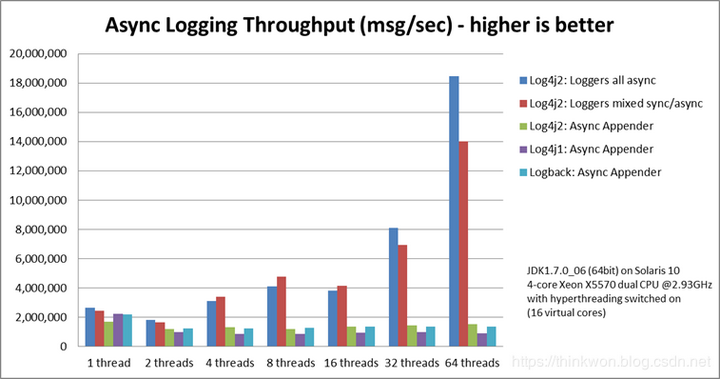
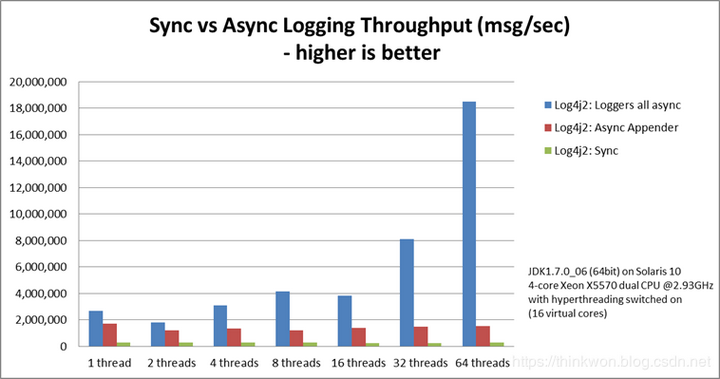
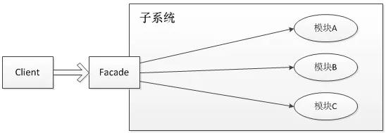

## Log4j

Log4j是Apache的一个Java的日志库，通过使用Log4j，我们可以控制日志信息输送的目的地（控制台、文件、数据库等）；我们也可以控制每一条日志的输出格式；通过定义每一条日志信息的级别，我们能够更加细致地控制日志的生成过程。

## Logback

Logback，一个“可靠、通用、快速而又灵活的Java日志框架”。logback当前分成三个模块：logback-core，logback- classic和logback-access。logback-core是其它两个模块的基础模块。logback-classic是log4j的一个改良版本。此外logback-classic完整实现SLF4J API使你可以很方便地更换成其它日志系统，如log4j或JDK14 Logging。logback-access模块与Servlet容器（如Tomcat和Jetty）集成，以提供HTTP访问日志功能。请注意，您可以在logback-core之上轻松构建自己的模块。

## Log4j2

Apache Log4j 2是对Log4j的升级，它比其前身Log4j 1.x提供了重大改进，并提供了Logback中可用的许多改进，同时修复了Logback架构中的一些问题。

现在最优秀的Java日志框架是Log4j2，没有之一。根据官方的测试表明，在多线程环境下，Log4j2的异步日志表现更加优秀。在异步日志中，Log4j2使用独立的线程去执行I/O操作，可以极大地提升应用程序的性能。

## Log4j1/Logback/Log4j2性能比较

在官方的测试中，Log4j1/Logback/Log4j2三个日志框架的异步日志性能比较如下图所示。

其中，Loggers all async是基于LMAX Disruptor实现的。可见Log4j2的异步日志性能是最棒的。

下图比较了Log4j2框架Sync、Async Appenders和Loggers all async三者的性能。其中Loggers all async表现最为出色，而且线程数越多，Loggers all async性能越好。

## 日志门面SLF4J

> 上述介绍的是一些日志框架的实现（Log4j、Logback、log4j2），这里我们需要用日志门面来解决系统与日志实现框架的耦合性。SLF4J，即简单日志门面（Simple Logging Facade for Java），它不是一个真正的日志实现，而是一个抽象层（ abstraction layer），它允许你在后台使用任意一个日志实现。

前面介绍的几种日志框架一样，每一种日志框架都有自己单独的API，要使用对应的框架就要使用其对应的API，这就大大的增加应用程序代码对于日志框架的耦合性。

使用了SLF4J后，对于应用程序来说，无论底层的日志框架如何变，应用程序不需要修改任意一行代码，就可以直接上线了。