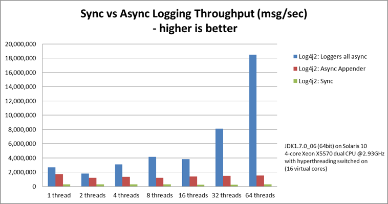
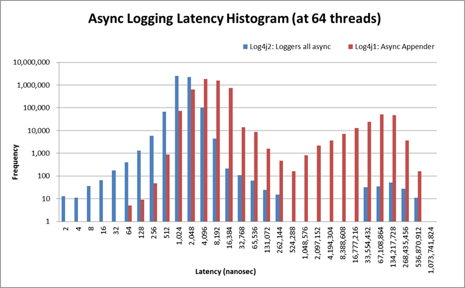
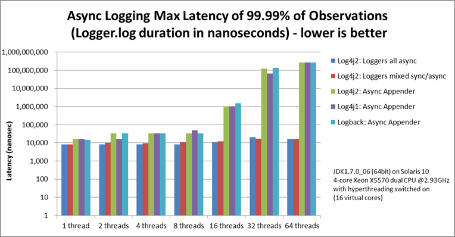

## 用于低延迟日志记录的异步记录器

异步日志记录可以通过在单独的线程中执行 I/O 操作来提高应用程序的性能。Log4j 2 在这方面做出了许多改进。

- **异步记录器**是 Log4j 2 的新增功能。它们的目标是尽快从对 Logger.log 的调用返回到应用程序。您可以选择使所有记录器异步或混合使用同步和异步记录器。使所有记录器异步将提供最佳性能，而混合则为您提供更大的灵活性。
- **LMAX 干扰器技术**。异步记录器内部使用 [Disruptor](https://logging.apache.org/log4j/log4j-2.3/manual/async.html#UnderTheHood)（一个无锁线程间通信库）而不是队列，从而实现更高的吞吐量和更低的延迟。
- **异步 Appender**已存在于 Log4j 1.x 中，但已得到增强，可以在批处理结束时（当队列为空时）刷新到磁盘。这会产生与配置“immediateFlush=true”相同的结果，即所有接收到的日志事件始终在磁盘上可用，但效率更高，因为它不需要在每个日志事件上都接触磁盘。（异步 Appender 在内部使用 ArrayBlockingQueue，不需要类路径上的 Disruptor jar。）
- （对于同步和异步使用）**随机访问文件追加器** 是缓冲文件追加器的替代方案。在幕后，这些新的附加程序使用 ByteBuffer + RandomAccessFile 而不是 BufferedOutputStream。在我们的测试中，速度大约快了 20-200%。这些附加程序还可以与同步记录器一起使用，并提供相同的性能优势。随机访问文件追加器不需要类路径上的干扰器 jar。


### 权衡

尽管异步日志记录可以带来显着的性能优势，但在某些情况下您可能希望选择同步日志记录。本节描述异步日志记录的一些权衡。

**好处**

- 更高的[吞吐量](https://logging.apache.org/log4j/log4j-2.3/manual/async.html#Performance)。使用异步记录器，您的应用程序可以以同步记录器的 6 - 68 倍的速率记录消息。
- 更低的日志记录[延迟](https://logging.apache.org/log4j/log4j-2.3/manual/async.html#Latency)。延迟是调用 Logger.log 返回所需的时间。异步记录器的延迟始终低于同步记录器甚至基于队列的异步附加器。对低延迟感兴趣的应用程序通常不仅关心平均延迟，而且还关心最坏情况的延迟。我们的性能比较表明，在将 99% 甚至 99.99% 的观测值的最大延迟与其他日志记录方法进行比较时，异步记录器也表现更好。
- 防止或抑制事件爆发期间的延迟峰值。如果队列大小配置得足够大以处理峰值，异步日志记录将有助于防止您的应用程序在活动突然爆发期间落后（尽可能多）。

**缺点**

- 错误处理。如果在日志记录过程中发生问题并引发异常，则异步记录器或附加程序不太容易向应用程序发出此问题的信号。`通过配置ExceptionHandler`可以部分缓解这个问题，但这可能仍然无法涵盖所有情况。因此，如果日志记录是您业务逻辑的一部分，例如，如果您使用 Log4j 作为审核日志记录框架，我们建议同步记录这些审核消息。（请注意，除了审计跟踪的同步日志记录之外， 您仍然可以将它们[组合起来并使用异步日志记录进行调试/跟踪日志记录。）](https://logging.apache.org/log4j/log4j-2.3/manual/async.html#MixedSync-Async)
- 在一些罕见的情况下，必须小心可变消息。大多数时候你不需要担心这个。Log4 将确保像 `logger.debug("My object is {}", myObject) 这样的日志消息将使用调用``logger.debug()`时`myObject`参数的状态 。即使稍后修改`myObject`，日志消息也不会更改。异步记录可变对象是安全的，因为 Log4j 内置的大多数[Message实现都会获取参数的快照。](https://logging.apache.org/log4j/log4j-2.3/log4j-api/apidocs/org/apache/logging/log4j/message/Message.html)但也有一些例外： [MapMessage](https://logging.apache.org/log4j/log4j-2.3/log4j-api/apidocs/org/apache/logging/log4j/message/MapMessage.html) 和 ````[StructuredDataMessage](https://logging.apache.org/log4j/log4j-2.3/log4j-api/apidocs/org/apache/logging/log4j/message/StructuredDataMessage.html) 在设计上是可变的：创建消息对象后可以将字段添加到这些消息中。这些消息在使用异步记录器或异步附加程序记录后不应被修改；您可能会也可能不会在结果日志输出中看到修改。同样，自定义 [消息](https://logging.apache.org/log4j/log4j-2.3/log4j-api/apidocs/org/apache/logging/log4j/message/Message.html) 实现在设计时应考虑异步使用，并且在构造时获取其参数的快照，或记录其线程安全特性。


### 使所有记录器异步

*需要类路径上有disruptor-3.0.0.jar 或更高版本。*

这是最简单的配置并提供最佳性能。要使所有记录器异步，请将干扰器 jar 添加到类路径并将系统属性`Log4jContextSelector`设置 为`org.apache.logging.log4j.core.async.AsyncLoggerContextSelector`。

默认情况下，异步记录器不会将[位置传递给 I/O 线程。](https://logging.apache.org/log4j/log4j-2.3/manual/async.html#Location)如果您的布局或自定义过滤器之一需要位置信息，则需要在所有相关记录器（包括根记录器）的配置中设置“includeLocation=true”。

不需要位置的配置可能如下所示：

```
<? xml 版本= “1.0”编码= “UTF-8” ？> <!-- 不要忘记设置系统属性-DLog4jContextSelector=org.apache.logging.log4j.core.async.AsyncLoggerContextSelector     使所有记录器异步。--> <配置状态= “警告” >   <附加器>    <!-- 异步记录器将批量自动刷新，因此请关闭立即刷新。-->    <RandomAccessFile name = “RandomAccessFile” fileName = “async.log” immediateFlush = “false” append = “false” >          <图案布局>        <模式> %d %p %c{1.} [%t] %m %ex%n </模式>      </图案布局>    </随机访问文件>  </附加器>  <记录器>    <根级别= "info" includeLocation = "false" >        <AppenderRef ref = “RandomAccessFile” />     </根>  </记录器></配置>
```

当使用`AsyncLoggerContextSelector`使所有记录器异步时，请确保在配置中使用正常的 `<root>`和`<logger>元素。`AsyncLoggerContextSelector 将确保所有记录器都是异步的，使用与配置`<asyncRoot>` 或`<asyncLogger>时发生的机制不同的机制`。后面的元素用于混合异步与同步记录器。如果同时使用这两种机制，您最终会得到两个后台线程，其中应用程序将日志消息传递给线程 A，线程 A 将消息传递给线程 B，然后线程 B 最终将消息记录到磁盘。这可行，但中间会有一个不必要的步骤。

您可以使用一些系统属性来控制异步日志记录子系统的各个方面。其中一些可用于调整日志记录性能。


| 系统属性                       | 默认值     | 描述                                                         |
| :----------------------------- | :--------- | :----------------------------------------------------------- |
| AsyncLogger.ExceptionHandler   | `无效的`   | `实现com.lmax.disruptor.ExceptionHandler`接口 的类的完全限定名称 。该类需要有一个公共的零参数构造函数。如果指定，则当记录消息时发生异常时，此类将收到通知。 |
| AsyncLogger.RingBufferSize     | 256*1024   | 异步日志记录子系统使用的 RingBuffer 的大小（槽数）。使该值足够大以应对突发活动。最小大小为 128。RingBuffer 将在首次使用时预先分配，并且在系统生命周期内永远不会增长或缩小。 |
| AsyncLogger.WaitStrategy       | `睡觉`     | 有效值：阻止、睡眠、产量。 `块`是一种对等待日志事件的 I/O 线程使用锁和条件变量的策略。当吞吐量和低延迟不像 CPU 资源那么重要时，可以使用块。建议用于资源受限/虚拟化环境。 `睡觉`是一种策略，首先旋转，然后使用 Thread.yield()，并最终在 I/O 线程等待日志事件时停放操作系统和 JVM 允许的最小纳秒数。睡眠是性能和 CPU 资源之间的一个很好的折衷方案。此策略对应用程序线程的影响非常小，但会带来实际记录消息的一些额外延迟。 `Yield`是一种使用 Thread.yield() 在初始旋转后等待日志事件的策略。产量是性能和 CPU 资源之间的一个很好的折衷方案，但可能会使用比睡眠更多的 CPU，以便更快地将消息记录到磁盘。 |
| AsyncLogger.ThreadNameStrategy | `缓存`     | 有效值：缓存、未缓存。 默认情况下，AsyncLogger 将线程名称缓存在 ThreadLocal 变量中以提高性能。如果您的应用程序在运行时修改线程名称（使用 `Thread.currentThread().setName()`）并且您希望查看日志中反映的新线程名称， 请指定`UNCACHED选项。``` |
| log4j.时钟                     | `系统时钟` | `org.apache.logging.log4j.core.helpers.Clock`接口 的实现 ，用于在所有记录器异步时为日志事件添加时间戳。 默认情况下，每个日志事件都会调用 `System.currentTimeMillis 。``CachedClock`是一种针对低延迟应用程序的优化，其中时间戳是从时钟生成的，该时钟每毫秒或每 1024 个日志事件更新一次后台线程中的内部时间，以先到者为准。这会稍微减少日志记录延迟，但代价是记录时间戳的一些精度。除非您记录许多事件，否则您可能会看到日志时间戳之间有 10-16 毫秒的“跳跃”。Web 应用程序警告：使用后台线程可能会导致 Web 应用程序和 OSGi 应用程序出现问题，因此不建议将 CachedClock 用于此类应用程序。`您还可以指定实现Clock`接口 的自定义类的完全限定类名 。 |


### 混合同步和异步记录器

*需要类路径上有disruptor-3.0.0.jar 或更高版本。无需将系统属性“Log4jContextSelector”设置为任何值。*

同步和异步记录器可以在配置中组合。这为您提供了更大的灵活性，但代价是性能略有下降（与使所有记录器异步相比）。使用`<asyncRoot>`或`<asyncLogger>` 配置元素指定需要异步的记录器。同一配置文件还可以包含同步记录器的 `<root>`和 `<logger>元素。`

默认情况下，异步记录器不会将[位置传递给 I/O 线程。](https://logging.apache.org/log4j/log4j-2.3/manual/async.html#Location)如果您的布局或自定义过滤器之一需要位置信息，则需要在所有相关记录器（包括根记录器）的配置中设置“includeLocation=true”。

混合异步记录器的配置可能如下所示：

```
<? xml 版本= “1.0”编码= “UTF-8” ？> <!-- 无需将系统属性“Log4jContextSelector”设置为任何值     使用 <asyncLogger> 或 <asyncRoot> 时。--> <配置状态= “警告” >   <附加器>    <!-- 异步记录器将批量自动刷新，因此请关闭立即刷新。-->    <RandomAccessFile名称= "RandomAccessFile" fileName = "asyncWithLocation.log"                立即刷新= “假”附加= “假” >       <图案布局>        <模式> %d %p %class{1.} [%t] %位置 %m %ex%n </模式>      </图案布局>    </随机访问文件>  </附加器>  <记录器>    <!-- 模式布局实际上使用了位置，所以我们需要包含它 -->    <AsyncLogger name = "com.foo.Bar" level = "trace" includeLocation = "true" >         <AppenderRef ref = “RandomAccessFile” />     </异步记录器>    <根级别= "info" includeLocation = "true" >        <AppenderRef ref = “RandomAccessFile” />     </根>  </记录器></配置>
```

您可以使用一些系统属性来控制异步日志记录子系统的各个方面。其中一些可用于调整日志记录性能。


| 系统属性                           | 默认值   | 描述                                                         |
| :--------------------------------- | :------- | :----------------------------------------------------------- |
| AsyncLoggerConfig.ExceptionHandler | `无效的` | `实现com.lmax.disruptor.ExceptionHandler`接口 的类的完全限定名称 。该类需要有一个公共的零参数构造函数。如果指定，则当记录消息时发生异常时，此类将收到通知。 |
| AsyncLoggerConfig.RingBufferSize   | 256*1024 | 异步日志记录子系统使用的 RingBuffer 的大小（槽数）。使该值足够大以应对突发活动。最小大小为 128。RingBuffer 将在首次使用时预先分配，并且在系统生命周期内永远不会增长或缩小。 |
| AsyncLoggerConfig.WaitStrategy     | `睡觉`   | 有效值：阻止、睡眠、产量。 `块`是一种对等待日志事件的 I/O 线程使用锁和条件变量的策略。当吞吐量和低延迟不像 CPU 资源那么重要时，可以使用块。建议用于资源受限/虚拟化环境。 `睡觉`是一种策略，首先旋转，然后使用 Thread.yield()，并最终在 I/O 线程等待日志事件时停放操作系统和 JVM 允许的最小纳秒数。睡眠是性能和 CPU 资源之间的一个很好的折衷方案。此策略对应用程序线程的影响非常小，但会带来实际记录消息的一些额外延迟。 `Yield`是一种使用 Thread.yield() 在初始旋转后等待日志事件的策略。产量是性能和 CPU 资源之间的一个很好的折衷方案，但可能会使用比睡眠更多的 CPU，以便更快地将消息记录到磁盘。 |


### 地点、地点、地点……

如果其中一个布局配置了与位置相关的属性，例如 HTML [locationInfo](https://logging.apache.org/log4j/log4j-2.3/manual/layouts.html#HtmlLocationInfo)或模式[%C 或 $class](https://logging.apache.org/log4j/log4j-2.3/manual/layouts.html#PatternClass)、 [%F 或 %file](https://logging.apache.org/log4j/log4j-2.3/manual/layouts.html#PatternFile)、 [%l 或 %location](https://logging.apache.org/log4j/log4j-2.3/manual/layouts.html#PatternLocation)、 [%L 或 %line](https://logging.apache.org/log4j/log4j-2.3/manual/layouts.html#PatternLine)、 [%M 或 % 之一方法中](https://logging.apache.org/log4j/log4j-2.3/manual/layouts.html#PatternMethod)，Log4j 将拍摄堆栈快照，并遍历堆栈跟踪以查找位置信息。

这是一项昂贵的操作：同步记录器慢 1.3 - 5 倍。同步记录器在拍摄此堆栈快照之前会等待尽可能长的时间。如果不需要位置，则永远不会拍摄快照。

但是，异步记录器需要在将日志消息传递到另一个线程之前做出此决定；该点之后位置信息将丢失。对于异步记录器来说，拍摄堆栈跟踪快照对性能的影响甚至更高：使用位置进行日志记录比不使用位置进行记录慢 4 - 20 倍。因此，异步记录器和异步追加器默认不包含位置信息。

`您可以通过指定includeLocation="true"` 来覆盖记录器或异步附加程序配置中的默认行为。


### 异步日志记录性能

下面的性能结果均来自运行 PerfTest、MTPerfTest 和 PerfTestDriver 类，这些类可以在 Log4j 2 单元测试源目录中找到。所有测试均使用默认设置（SystemClock 和 SleepingWaitStrategy）完成。所有测试使用的方法都是相同的：

- 首先，通过记录 200,000 条 500 个字符的日志消息来预热 JVM。
- 重复预热 10 次，然后等待 10 秒，让 I/O 线程跟上并耗尽缓冲区。
- 延迟测试：在低于饱和度的情况下，测量调用 Logger.log 需要多长时间。测量之间暂停 10 微秒 * threadCount。重复此操作 500 万次，并测量平均延迟、99% 观测值和 99.99% 观测值的延迟。
- 吞吐量测试：测量执行 256 * 1024 / threadCount 调用 Logger.log 所需的时间，并以每秒消息数表示结果。
- 重复测试 5 次，取结果的平均值。

以下结果是使用 log4j-2.0-beta5、disruptor-3.0.0.beta3、log4j-1.2.17 和 logback-1.0.10 获得的。

#### 记录吞吐量

下图比较了同步记录器、异步附加器和异步记录器的吞吐量。这是所有线程的总吞吐量。在 64 个线程的测试中，异步记录器比异步追加器快 12 倍，比同步记录器快 68 倍。

异步记录器的吞吐量随着线程数量的增加而增加，而同步记录器和异步附加器都具有或多或少恒定的吞吐量，无论执行日志记录的线程数量如何。



#### 与其他日志记录包的异步吞吐量比较

我们还将异步记录器的吞吐量与其他日志记录包（特别是 log4j-1.2.17 和 logback-1.0.10）中可用的同步记录器和异步附加器进行了比较，结果相似。对于异步附加程序，当添加更多线程时，所有线程的总日志记录吞吐量大致保持不变。在多线程场景中，异步记录器可以更有效地利用机器上可用的多个内核。


在带有 JDK1.7.0_06、4 核 Xeon X5570 双 CPU @2.93Ghz 并开启超线程的 Solaris 10（64 位）上（16 个虚拟核）：

| 记录器                       | 1 线程    | 2 线程  | 4 线程  | 8 线程  | 16 线程 | 32个线程 | 64个线程 |
| :--------------------------- | :-------- | :------ | :------ | :------ | :------ | :------- | :------- |
| Log4j 2：记录器全部异步      | 2,652,412 | 909,119 | 776,993 | 516,365 | 239,246 | 253,791  | 288,997  |
| Log4j 2：记录器混合同步/异步 | 2,454,358 | 839,394 | 854,578 | 597,913 | 261,003 | 216,863  | 218,937  |
| Log4j 2：异步追加器          | 1,713,429 | 603,019 | 331,506 | 149,408 | 86,107  | 45,529   | 23,980   |
| Log4j1：异步追加器           | 2,239,664 | 494,470 | 221,402 | 109,314 | 60,580  | 31,706   | 14,072   |
| Logback：异步Appender        | 2,206,907 | 624,082 | 307,500 | 160,096 | 85,701  | 43,422   | 21,303   |
| Log4j 2：同步                | 273,536   | 136,523 | 67,609  | 34,404  | 15,373  | 7,903    | 4,253    |
| Log4j1：同步                 | 326,894   | 105,591 | 57,036  | 30,511  | 13,900  | 7,094    | 3,509 人 |
| 日志返回：同步               | 178,063   | 65,000  | 34,372  | 16,903  | 8,334   | 3,985    | 1,967 人 |


在带有 JDK1.7.0_11、2 核 Intel i5-3317u CPU @1.70Ghz 并开启超线程的 Windows 7（64 位）上（4 个虚拟核心）：

| 记录器                       | 1 线程    | 2 线程    | 4 线程    | 8 线程    | 16 线程   | 32个线程 |
| :--------------------------- | :-------- | :-------- | :-------- | :-------- | :-------- | :------- |
| Log4j 2：记录器全部异步      | 1,715,344 | 928,951   | 1,045,265 | 1,509,109 | 1,708,989 | 773,565  |
| Log4j 2：记录器混合同步/异步 | 571,099   | 1,204,774 | 1,632,204 | 1,368,041 | 462,093   | 908,529  |
| Log4j 2：异步追加器          | 1,236,548 | 1,006,287 | 511,571   | 302,230   | 160,094   | 60,152   |
| Log4j1：异步追加器           | 1,373,195 | 911,657   | 636,899   | 406,405   | 202,777   | 162,964  |
| Logback：异步Appender        | 1,979,515 | 783,722   | 582,935   | 289,905   | 172,463   | 133,435  |
| Log4j 2：同步                | 281,250   | 225,731   | 129,015   | 66,590    | 34,401    | 17,347   |
| Log4j1：同步                 | 147,824   | 72,383    | 32,865    | 18,025    | 8,937     | 4,440    |
| 日志返回：同步               | 149,811   | 66,301    | 32,341    | 16,962    | 8,431     | 3,610    |

#### 位置记录的吞吐量 (includeLocation="true")

在带有 JDK1.7.0_06 的 Solaris 10（64 位）上，4 核 Xeon X5570 双 CPU @2.93Ghz，超线程已关闭（8 个虚拟核心）：

| 记录器 (Log4j 2)    | 1 线程 | 2 线程 | 4 线程 | 8 线程 |
| :------------------ | :----- | :----- | :----- | :----- |
| 记录器全部异步      | 75,862 | 88,775 | 80,240 | 68,077 |
| 记录器混合同步/异步 | 61,993 | 66,164 | 55,735 | 52,843 |
| 异步追加器          | 47,033 | 52,426 | 50,882 | 36,905 |
| 同步                | 31,054 | 33,175 | 29,791 | 23,628 |

正如预期的那样，记录位置信息会对性能产生很大影响。异步记录器慢 4 - 20 倍，而同步记录器慢 1.3 - 5 倍。但是，如果您确实需要位置信息，异步日志记录仍然比同步日志记录更快。


#### 潜伏

延迟测试是通过在低于饱和度的情况下进行记录来完成的，测量对 Logger.log 的调用需要多长时间才能返回。每次调用 Logger.log 后，测试都会等待 10 微秒 * threadCount，然后再继续。每个线程记录 500 万条消息。

下面的所有延迟测量都是在 Solaris 10（64 位）、JDK1.7.0_06、4 核 Xeon X5570 双 CPU @2.93Ghz 上运行的测试结果，超线程已打开（16 个虚拟核心）。



请注意，这是对数尺度，而不是线性的。上图比较了异步记录器和 Log4j 1.2.17 异步 Appender 的延迟分布。这显示了 64 个线程并行记录的测试期间一个线程的延迟。测试针对异步记录器运行一次，针对异步附加程序运行一次。

|                              | 平均延迟 | 99% 的观测值小于 | 99.99% 的观测值小于 |             |        |             |
| :--------------------------- | :------- | :--------------- | :------------------ | :---------- | :----- | :---------- |
|                              | 1 线程   | 64个线程         | 1 线程              | 64个线程    | 1 线程 | 64个线程    |
| Log4j 2：记录器全部异步      | 第677章  | 4,135            | 1,638               | 4,096       | 8,192  | 16,128      |
| Log4j 2：记录器混合同步/异步 | 第648章  | 4,873            | 1,228               | 4,096       | 8,192  | 16,384      |
| Log4j 2：异步追加器          | 2,423    | 2,117,722        | 4,096               | 67,108,864  | 16,384 | 268,435,456 |
| Log4j1：异步追加器           | 1,562 人 | 1,781,404        | 4,096               | 109,051,904 | 16,384 | 268,435,456 |
| Logback：异步Appender        | 2,123    | 2,079,020        | 3,276               | 67,108,864  | 14,745 | 268,435,456 |

下面的延迟比较图也是对数尺度的，显示了异步记录器和基于 ArrayBlockingQueue 的异步追加器在并行运行的线程越来越多的情况下的平均延迟。最多 8 个线程的异步附加程序具有相当的平均延迟，是异步记录器的两倍或三倍。对于更多线程，异步追加器的平均延迟比异步记录器大几个数量级。


对低延迟感兴趣的应用程序通常不仅关心平均延迟，而且还关心最坏情况的延迟。下图显示，将 99.99% 观测值的最大延迟与其他日志记录方法进行比较时，异步记录器也表现更好。当增加线程数量时，异步记录器的绝大多数延迟测量值停留在 10-20 微秒范围内，其中异步 Appender 开始经历 100 毫秒范围内的许多延迟峰值，相差四个数量级。




#### FileAppender 与 RandomAccessFileAppender

下面的附加器比较是使用*同步记录器*完成的。

在带有 JDK1.7.0_11、2 核 Intel i5-3317u CPU @1.70Ghz 并开启超线程的 Windows 7（64 位）上（4 个虚拟核心）：

| 附加器                 | 1 线程  | 2 线程  | 4 线程  | 8 线程 |
| :--------------------- | :------ | :------ | :------ | :----- |
| 随机访问文件附加器     | 250,438 | 169,939 | 109,074 | 58,845 |
| 文件附加器             | 186,695 | 118,587 | 57,012  | 28,846 |
| 滚动随机访问文件附加器 | 278,369 | 213,176 | 125,300 | 63,103 |
| 滚动文件附加器         | 182,518 | 114,690 | 55,147  | 28,153 |

在带有 JDK1.7.0_06 的 Solaris 10（64 位）上，4 核双 Xeon X5570 CPU @2.93GHz，超线程关闭（8 个虚拟核）：

| 附加器                 | 1 线程  | 2 线程  | 4 线程 | 8 线程 |
| :--------------------- | :------ | :------ | :----- | :----- |
| 随机访问文件附加器     | 240,760 | 128,713 | 66,555 | 30,544 |
| 文件附加器             | 172,517 | 106,587 | 55,885 | 25,675 |
| 滚动随机访问文件附加器 | 228,491 | 135,355 | 69,277 | 32,484 |
| 滚动文件附加器         | 186,422 | 97,737  | 55,766 | 25,097 |


### 幕后花絮

异步记录器是使用 [LMAX Disruptor](http://lmax-exchange.github.com/disruptor/) 线程间消息传递库实现的。来自 LMAX 网站：

> ...使用队列在系统各阶段之间传递数据会引入延迟，因此我们专注于优化该领域。Disruptor 是我们研究和测试的结果。我们发现 CPU 级别的缓存未命中以及需要内核仲裁的锁都非常昂贵，因此我们创建了一个对其运行的硬件具有“机械同情”的框架，并且该框架是无锁的。