# Logback与Log4j2日志框架性能对比与调优方式

 更新时间：2021年12月22日 14:26:12  作者：小老板v  

这篇文章主要介绍了Logback与Log4j2日志框架性能对比与调优方式，具有很好的参考价值，希望对大家有所帮助。如有错误或未考虑完全的地方，望不吝赐教

**−**

##### 目录

- [前言](https://www.jb51.net/article/232630.htm#_label0)

- [性能测试](https://www.jb51.net/article/232630.htm#_label1)

- - [logback](https://www.jb51.net/article/232630.htm#_lab2_1_0)

  - - [同步日志](https://www.jb51.net/article/232630.htm#_label3_1_0_0)
    - [异步日志（队列扩容）](https://www.jb51.net/article/232630.htm#_label3_1_0_1)
    - [异步日志（半队列扩容）](https://www.jb51.net/article/232630.htm#_label3_1_0_2)

  - [log4j2](https://www.jb51.net/article/232630.htm#_lab2_1_1)

  - - [同步日志](https://www.jb51.net/article/232630.htm#_label3_1_1_3)
    - [异步日志（队列扩容）](https://www.jb51.net/article/232630.htm#_label3_1_1_4)
    - [异步日志（日志淘汰策略）](https://www.jb51.net/article/232630.htm#_label3_1_1_5)
    - [异步日志（半队列扩容）](https://www.jb51.net/article/232630.htm#_label3_1_1_6)
    - [异步日志（等待策略）](https://www.jb51.net/article/232630.htm#_label3_1_1_7)

- [性能调优](https://www.jb51.net/article/232630.htm#_label2)

- - [异步日志](https://www.jb51.net/article/232630.htm#_lab2_2_2)

  - - [日志可靠性](https://www.jb51.net/article/232630.htm#_label3_2_2_8)
    - [Logback](https://www.jb51.net/article/232630.htm#_label3_2_2_9)
    - [Log4j2](https://www.jb51.net/article/232630.htm#_label3_2_2_10)

  - [日志抛弃策略](https://www.jb51.net/article/232630.htm#_lab2_2_3)

  - - [Log4j2](https://www.jb51.net/article/232630.htm#_label3_2_3_11)
    - [Logback](https://www.jb51.net/article/232630.htm#_label3_2_3_12)

  - [日志等待策略](https://www.jb51.net/article/232630.htm#_lab2_2_4)

  - - [TimeoutWaitStrategy](https://www.jb51.net/article/232630.htm#_label3_2_4_13)
    - [YieldWaitStrategy](https://www.jb51.net/article/232630.htm#_label3_2_4_14)

  - [队列容量](https://www.jb51.net/article/232630.htm#_lab2_2_5)

  - - [Logback](https://www.jb51.net/article/232630.htm#_label3_2_5_15)
    - [Log4j2](https://www.jb51.net/article/232630.htm#_label3_2_5_16)
    - [长度计算公式](https://www.jb51.net/article/232630.htm#_label3_2_5_17)

  - [消费瓶颈](https://www.jb51.net/article/232630.htm#_lab2_2_6)

  - - [消费TPS](https://www.jb51.net/article/232630.htm#_label3_2_6_18)
    - [请求TPS](https://www.jb51.net/article/232630.htm#_label3_2_6_19)
    - [消费者优化](https://www.jb51.net/article/232630.htm#_label3_2_6_20)


## 前言

看到目前线上大多日志框架测评大多从宏观角度，直接对比异步同步的吞吐量，**但是没有考量到更深层的淘汰机制、等待策略、队列长度等对性能表现的影响**，因此本文将从更多的角度对比及分析两款日志框架的性能表现，通过JProfiler+Jmeter压测及数据采集，从线程占用、锁占用、宏观耗时等多维度可视化数据。


## 性能测试


### logback


#### 同步日志

**耗时**

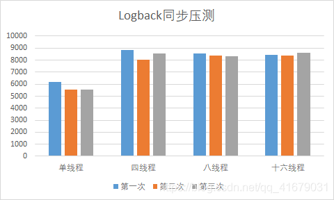

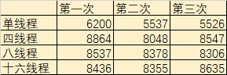

未经过任何调优，采用Logback默认配置得出上图，一百万条日志打印耗时(ms)，如图：单线程下性能最佳，耗时随线程数增加而下降。

**线程占用**

单线程


**无阻塞状态**

多线程

多线程打印日志时，会产生大量线程阻塞，线程越多阻塞状态越多

四线程

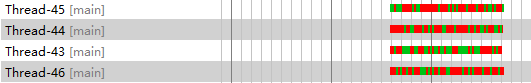

八线程

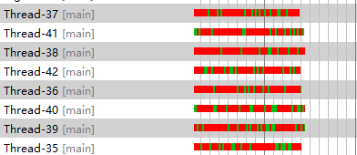

十六线程

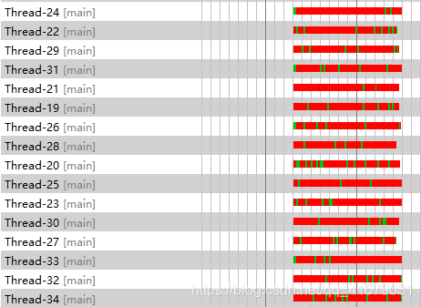

**锁占用**

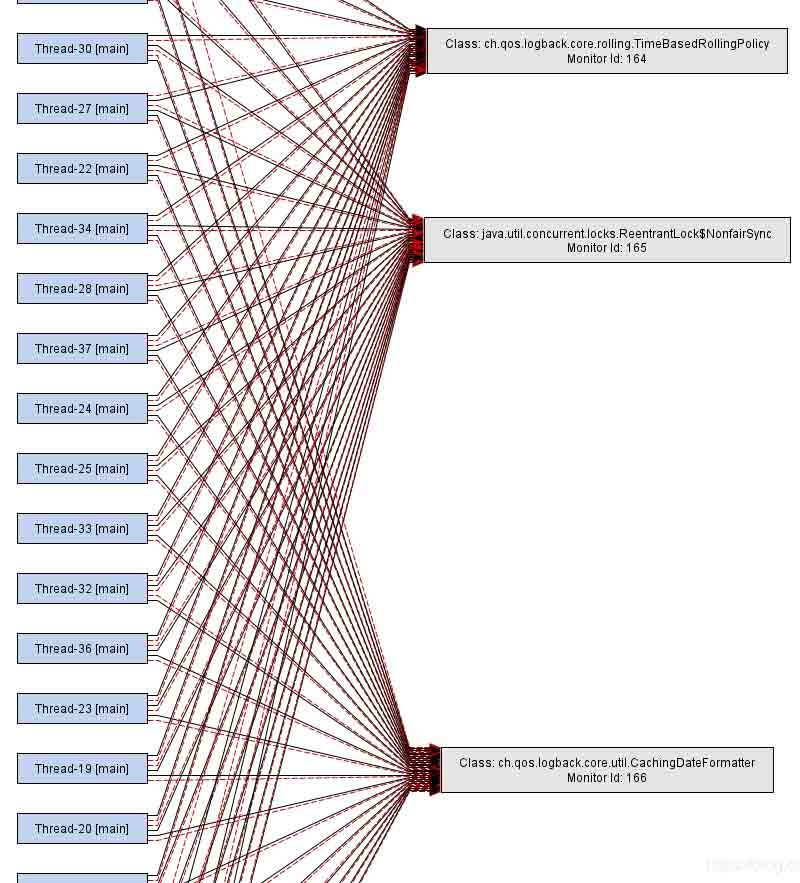

线程发生多次占用锁的情况。查看Logback源码可得知，检查容量、放入队列、取出队列都需要在取得锁后进行


#### 异步日志（队列扩容）

样本数100万，队列长度110万

**耗时**

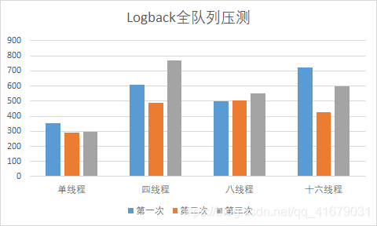

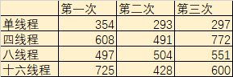

**线程占用**

单线程


多线程

四线程


八线程

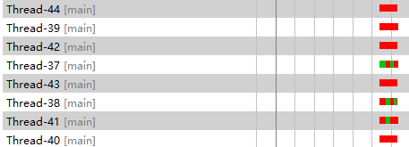

十六线程

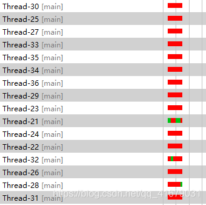

**锁占用**

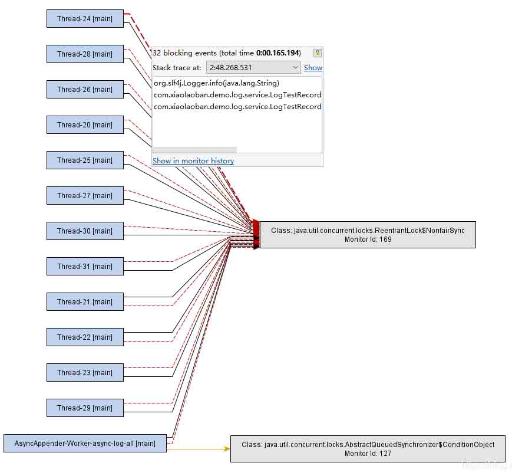

每次写入队列都需要占用锁，同时Appender从队列取出也需要占用锁


#### 异步日志（半队列扩容）

样本数100万，队列长度50万，不启用抛弃策略

**耗时**

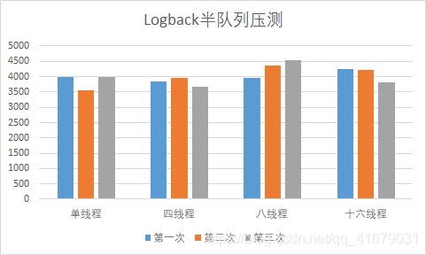

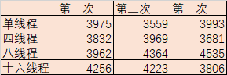

**线程占用**

单线程


多线程

写入耗时明显增长，写入过程仍然发生阻塞状态

四线程


八线程

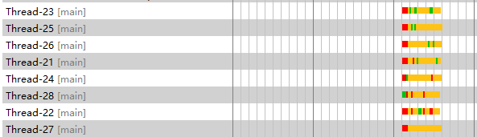

十六线程

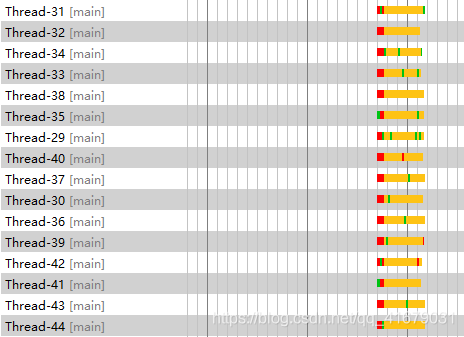

**锁占用**

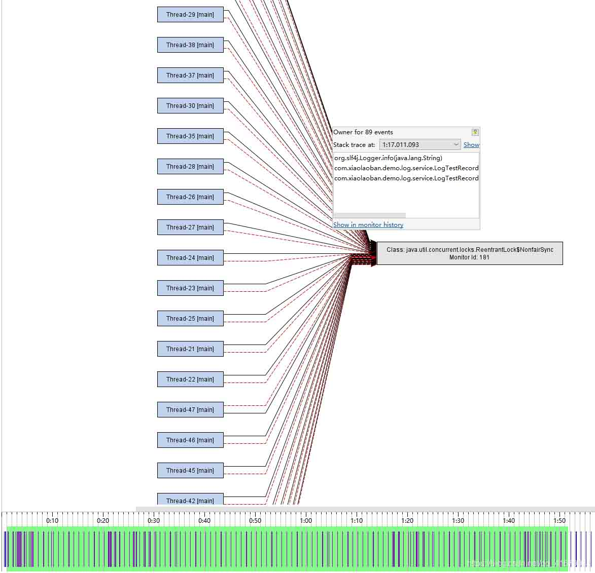


### log4j2

#### 同步日志

样本数100万，Logger到Appender串行执行，输出到文件

**耗时**

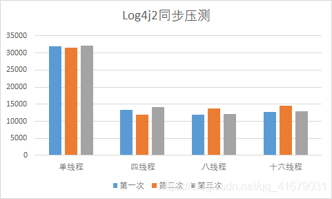

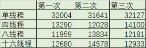

**线程占用**

线程产生长时间的等待，主要是缓冲环溢出后无法写入，生产者根据等待策略进入等待状态

单线程


单线程生产不需要争抢锁，因此全程无阻塞

多线程

整体来看，阻塞的时间随着线程增多而增多，因此多线程对同步日志影响极大，性能损失严重

四线程

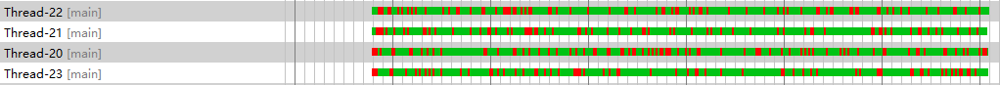

八线程

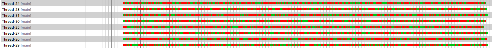

十六线程

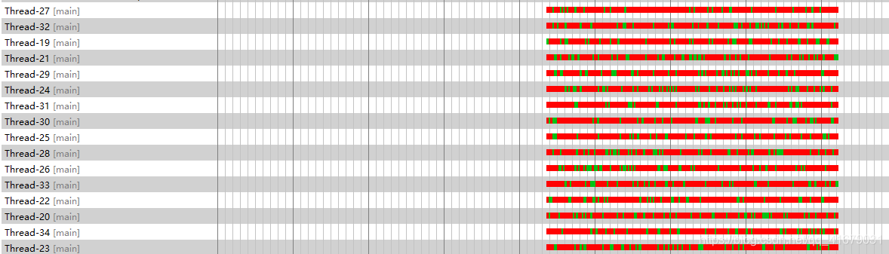

后续监控因阻塞时间太长跳过

**锁占用**

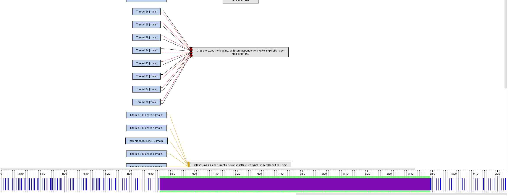

阻塞在Appender上的输出流上，输出流是在单线程中执行的

#### 异步日志（队列扩容）

样本数100万，队列长度110万，使用Yield等待策略

**耗时**

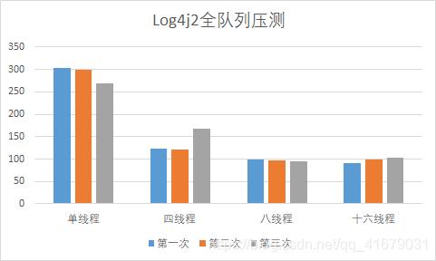

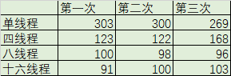

单线程占用最高，耗时随线程数增加而缩短，直到线程数超过CPU核数。单线程耗时与logback相当，多线程耗时比logback缩短了2倍

**线程占用**

单线程与多线程使用都无阻塞状态，保证足够的队列容量，能使日志操作保持高吞吐和低延迟，避免阻塞等待

单线程


多线程

四线程


八线程

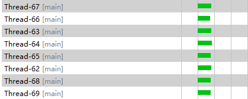

使用与宿主机CPU核数相等的线程数，日志写入过程无阻塞、无线程切换

十六线程

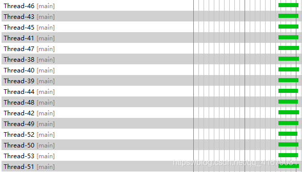


#### 异步日志（日志淘汰策略）

样本数100万，队列长度50万，启用抛弃策略

**耗时**

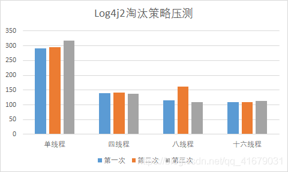

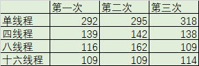

**线程占用**

队列长度50万，正常来说应与半队列扩容一样，产生阻塞现象，但启用了日志淘汰策略，无法写入队列的将直接抛弃不阻塞等待

单线程


多线程

四线程


八线程

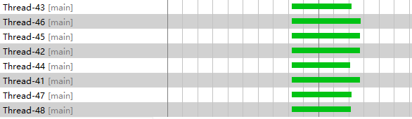

十六线程

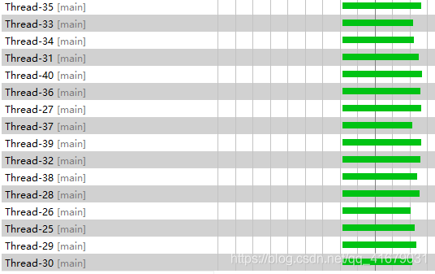

#### 异步日志（半队列扩容）

样本数100万，队列长度50万，使用Yield等待策略

**耗时**

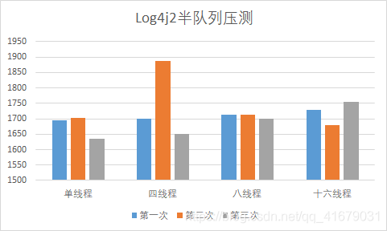

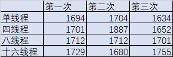

当队列满后，大幅影响了响应时间，吞吐量依赖Appender的消费性能

**线程占用**

单线程记录日志时，前半段队列未满时生产线程一直处于工作状态，后半段因消费能力跟不上生产能力，导致队列满载，生产线程开始出现等待状态

单线程


等待的时间比多线程少，是因为单线程下日志生产速度慢，同时日志也在倍消费

多线程

前一段时间可以维持高性能工作，但后面队列满后开始发送等待，导致耗时延长

四线程


八线程

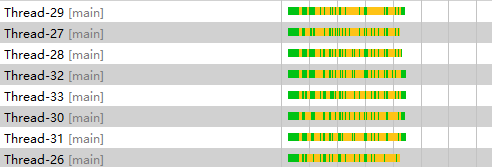

十六线程

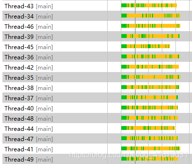

**锁占用**

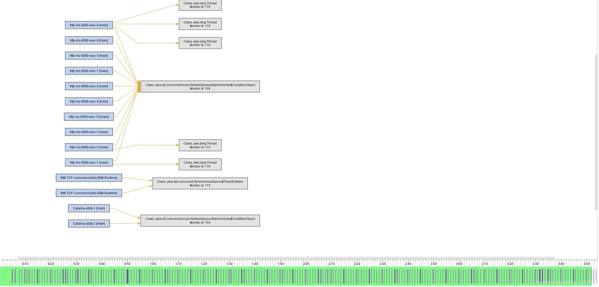

并未发现日志记录过程中发生锁占用


#### 异步日志（等待策略）

样本数100万，队列长度50万，使用Timeout等待策略

**耗时**

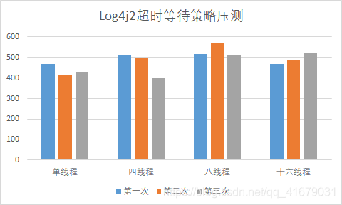


**线程占用**


**未产生阻塞状态**

单线程

多线程

因Timeout等待策略使用了锁，因此产生一定的阻塞

四线程


八线程


十六线程

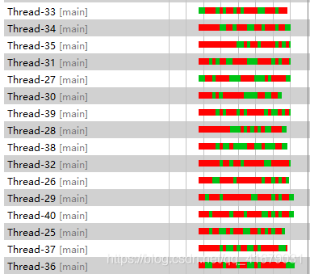

锁占用

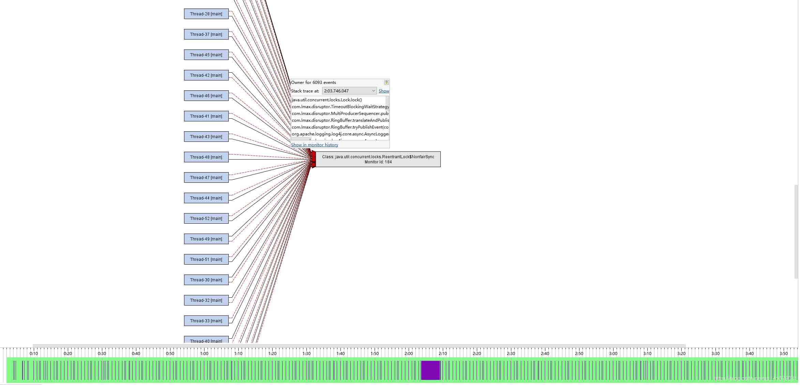

使用Timeout等待策略时，放入队列前会取锁，进行消费者线程唤醒动作


## 性能调优


### 异步日志

无论是logback还是log4j2，使用异步日志可以大幅提高日志操作耗时，间接提高业务方整体耗时


#### 日志可靠性

异步日志无法保证日志可靠性，系统意外关闭会丢失队列中的日志，因此要求高可靠的日志，应该选择数据库或者MQ来保证


#### Logback

通过

```
<appender name=``"async-log-all"` `class``=``"ch.qos.logback.classic.AsyncAppender"``>
```

设置


#### Log4j2

通过

```
System.setProperty(``"Log4jContextSelector"``, ``"org.apache.logging.log4j.core.async.AsyncLoggerContextSelector"``)
```

设置


### 日志抛弃策略

将溢出队列的日志抛弃，保持稳定的响应速度。对业务方来说能保持良好、稳定的日志服务，但需要容忍一定的日志丢

#### Log4j2

通过

```
System.setProperty(``"log4j2.AsyncQueueFullPolicy"``,``"Discard"``)
```

设置

#### Logback

通过&lt;discardingThreshold&gt;指定抛弃日志的阈值

**抛弃边界**

当队列剩余容量小于阈值后，将抛弃ERROR以下的日志

**禁用抛弃策略**

设置为0则表示不抛弃，业务线程等待队列空间可用后写入

**默认阈值**

默认阈值为队列长度的20%，队列长度100阈值为20


### 日志等待策略

Log4j2独有的特性，指定队列满时，生产者进行等待的行为，需要在不开启抛弃策略下进行


#### TimeoutWaitStrategy

Log4j2默认的等待策略，通过Object.wait等待队列腾空。在放入队列时会加锁，不推荐使用。


#### YieldWaitStrategy

通过

```
System.setProperty(``"log4j2.asyncLoggerWaitStrategy"``,``"Yield"``)
```

设置。通过System.yield()等待队列腾空，比Timeout等待策略更高效，比Busy等待策略更节能


### 队列容量

由性能测试可知，不适用日志抛弃策略下，队列满载后生产线程将阻塞等待队列腾空，直接影响业务方的效率

#### Logback

通过<queueSize>指定队列长度，Logback固定使用ArrayBlockingQueue作为队列

#### Log4j2

通过

```
System.setProperty(``"log4j2.asyncLoggerRingBufferSize"``,``"x"``)
```

指定

**二次方长度**

RingBuffer内部计算位置时通过二进制方式计算，使用二的指数长度可以提高计算速度


#### 长度计算公式

暂未找到统一标准的计算公式，本人觉得可以通过(日志峰值TPS#消费TPS)*15*60来计算

**承载容量**

这个公式的含义是：应用15分钟以峰值去生产的日志可以全部被队列容纳

**成本**

从成本的角度看，队列不应该无限量地预估，在保证系统不受到容量影响下，尽可能地使用小的长度，节省内存开支

**响应时间**

一般应用不应该长时间在峰值运行，如果出现长时间在峰值运行，则应该进行水平拓展分散请求压力。因此容纳15分钟之内的峰值，可以有足够时间让运维响应，进行水平拓展分散压力。


### 消费瓶颈

日志消费TPS由Appender消费效率决定，当日志TPS超过消费TPS时，日志将开始在队列中堆积


#### 消费TPS

某个Appender在一秒内消费的日志数量，举FileAppender为例，每条日志消费花费100微妙(性能好的主机可以到60)，一秒可以消费1万条日志，即消费TPS为1万


#### 请求TPS

一般Web应用不会承载超过消费TPS的流量。假设每个请求打印五条日志，则需要5000以上的TPS才能产生日志堆积


#### 消费者优化

日志TPS长时间(15min+)超过消费TPS的场景下，应该对消费能力进行优化，使用轻量级的Appedner、简单的Layout、日志抛弃策略、过滤器、业务方规范等方面进行优化