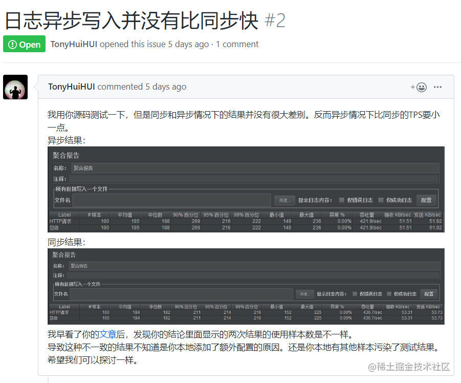
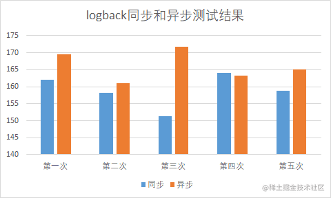
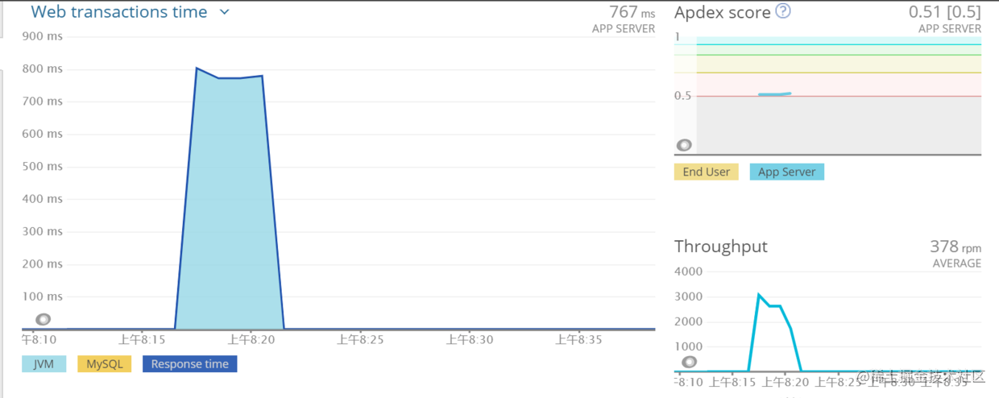
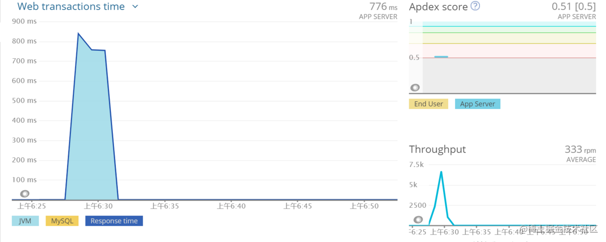
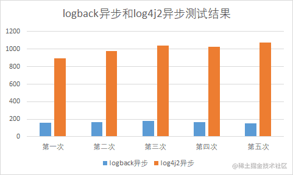

# 日志框架，选择Logback Or Log4j2？

[何甜甜在吗](https://juejin.cn/user/2576910985986056/posts)

2019-08-29 00:0510656

### 写在前面

前段时间写了一篇文章(文章链接：[Logback配置文件这么写，TPS提高10倍](https://juejin.cn/post/6844903909920604174))，反响还不错，有很多网友也发表了自己的意见：

总结一下就是：

- logback性能测试同步和异步TPS相差不大
- 都9102年了还在用logback

看到网友的意见后又继续去做了一波测试和调研

### 服务器硬件

- CPU 六核
- 内存 8G

### 测试工具

- JMeter
- JProfile
- APM(New Relic)

### logback日志框架同步和异步测试

之前的测试结果存在以下几点问题：

- 测试样本数过少(即线程数和循环执行次数过少，之前线程数为100，循环1次，样本总数为100)
- 测试次数过少，只进行了一次测试，结果存在偶然性
- 两次测试结果存在污染，样本数量不一样

针对以上问题，重新测试中将线程数修改为200，每次测试中循环100次，样本总数为2w，和原来测试的样本数相比扩大200倍，并且重复测试5次。 新的测试结果如下：

新的测试结果表明，使用logback日志框架同步和异步输出日志方式的TPS相差不大。把数据制作成柱形图更直观

但是总觉得异步去写日志了，访问api的线程将更快响应客户端，TPS就应该有明显的变化才对。想不通又去网上查阅了一些资料，有反应说通过`APM`进行性能监控，同步和异步的TPS将会有较大的差别，TPS一定是会有明显变化的(呐喊)，于是用APM去监控JMeter发送的请求(`JMeter`参数设置为线程数100，Ramp-up Period为0，循环100次)： APM测试结果如下：

APM监控下，在执行的五分钟内异步输出日志TPS平均为378rpm

APM监控下，在执行的五分钟内同步输出日志TPS平均为333rpm 发现TPS同步和异步相比还是不明显

又一次证明失败 虽然想不明白但后来和网友探讨了下，醍醐灌顶

TPS变化不明显的原因如下： TPS为每秒处理事务数，每个事务包括了如下3个过程：

- 用户请求服务器
- 服务器自己的内部处理
- 服务器返回给用户

服务器自己的内部请求包括访问数据库、处理逻辑和打印日志，同步和异步中唯一不同的就是打印日志的方式。而从测试结果来看，打印日志耗时只占API访问请求的5.3%，所以缩短打印日志耗时不能很明显的提高TPS，因为打印时间和网络请求、业务处理消耗时间可以忽略不计 但是测试结果表明，虽然使用异步输出方式不能明显提高TPS，但是能够减少打印日志的耗时。所以使用logback日志框架还是推荐使用异步输出方式

### 推荐使用log4j2而不是logback

log4j2是log4j 1.x 的升级版，参考了logback的一些优秀的设计，并且修复了一些问题，带来了一些重大的提升，在异步方面的性能得到了巨大提升，其除了提供Async Append异步实现外还提供了Async Log异步实现，其中Async Append异步实现方式和logback的异步实现差不多，而Async Log基于LMAX Disruptor库，实现了一个高性能的异步记录器。本次测试中log4j2异步实现是基于Async Log。 JMeter测试参数和之前的logback测试一样，线程数200，循环次数100，重复五轮。并且logj2日志配置文件基本和logback异步配置相同，满足：

- 控制台打印日志
- 分类输出日志
- 按天滚动
- 同样的日志输出格式

测试结果如下：

将TPS制作为柱形图

**TPS提升了6倍！！！**，并且打印日志的耗时都快到统计不出来了 官方提供的测试报告中，log4j2和logback相比性能提升更明显。附官方测试报告：[Asynchronous Loggers for Low-Latency Logging](https://link.juejin.cn/?target=https%3A%2F%2Flogging.apache.org%2Flog4j%2Flog4j-2.3%2Fmanual%2Fasync.html)

### 结论

- 如果使用logback框架，推荐使用异步输出日志方式

- 选择日志框架，推荐使用log4j2

  最后附：[测试代码](https://link.juejin.cn/?target=https%3A%2F%2Fgithub.com%2FTiantianUpup%2Fspringboot-log)