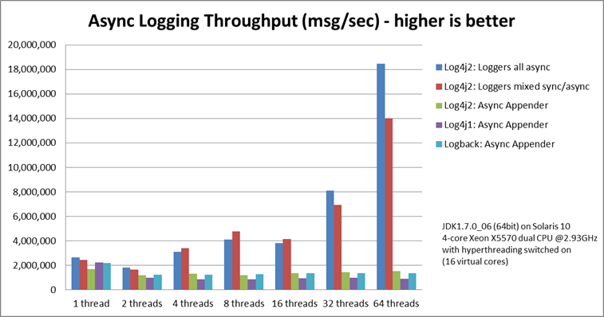
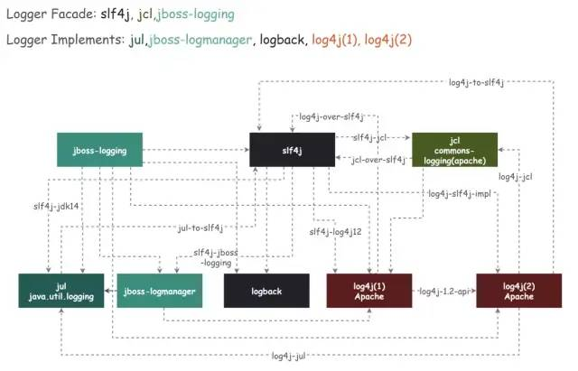

## 还在用Logback？Log4j2的异步性能已经无敌了，还不快试试

发布于 2021-04-23 10:35:10

7490

举报

来源：[juejin.cn/post/6945753017878577](https://cloud.tencent.com/developer/tools/blog-entry?target=https://mp.weixin.qq.com/s?__biz=MzUzMTA2NTU2Ng==&mid=2247487551&idx=1&sn=18f64ba49f3f0f9d8be9d1fdef8857d9&chksm=fa496f8ecd3ee698f4954c00efb80fe955ec9198fff3ef4011e331aa37f55a6a17bc8c0335a8&scene=21&token=899450012&lang=zh_CN#wechat_redirect)

**Logback**  算是JAVA 里一个老牌的日志框架，从06年开始第一个版本，迭代至今也十几年了。不过logback最近一个稳定版本还停留在 2017 年，好几年都没有更新；logback的兄弟 slf4j 最近一个稳定版也是2017年，有点凉凉的意思。

而且 logback的异步性能实在拉跨，功能简陋，配置又繁琐，远不及Apache 的新一代日志框架 - **Log4j2**

**目前来看，Log4j2 就是王者，其他日志框架都不是对手**

# **Log4j2简介**

Apache Log4j 2是 Log4j(1) 的升级版，比它的祖先 Log4j 1. x 有了很大的改进，和logback对比有很大的改进。除了内部设计的调整外，主要有以下几点的大升级：

- 更简化的配置
- 更强大的参数格式化
- 最夸张的异步性能

Log4j 2中，分为 **API(log4j-api）** 和 **实现(log4j-core)** 两个模块。API 和slf4j 是一个类型，属于日志抽象/门面，而实现部分，才是Log4j 2的核心。

- org.apache.logging.log4j » log4j-api
- org.apache.logging.log4j » log4j-core

# **特性**

## **最强的异步性能**

这个特性，算是Log4j2最强之处了。log4j2 在目前JAVA中的日志框架里，异步日志的性能是最高的，没有之一。

先来看一下，几种日志框架benchmark对比结果（log4j2官方测试结果）：



从图上可以看出，log4j2的异步（全异步，非混合模式）下的性能，远超log4j1和logback，简直吊打。压力越大的情况下，吞吐上的差距就越大。 **在64线程测试下，log4j2的吞吐达到了180w+/s，而logback/log4j1只有不到20w，相差近十倍**

## **零GC（Garbage-free）**

从2.6版本开始（2016年），log4j2 默认就以零GC模式运行了。什么叫零GC呢？就是不会由于log4j2而导致GC。

log4j2 中 **各种Message对象，字符串数组，字节数组等全部复用** ，不重复创建，大大减少了无用对象的创建，从而做到“零GC”。

## **更高性能 I/O 写入的支持**

log4j 还提供了一个MemoryMappedFileAppender，I/O 部分使用MemoryMappedFile来实现，可以得到极高的I/O性能。**不过在使用MemoryMappedFileAppender之前，得确定你足够了解MemoryMappedFile的相关知识，否则不要轻易使用呦。**

# **更强大的参数格式化**

API模块和slf4j相比，提供了更丰富的参数格式化功能。

## **使用 `{}`占位符格式化参数**

在slf4j里，我们可以用 `{}`的方式来实现“format”的功能（参数会直接toString替换占位符），像下面这样：

```javascript
logger.debug("Logging in user {} with birthday {}", user.getName(), user.getBirthdayCalendar());
```

复制

## **使用String.format的形式格式化参数**

log4j2 中除了支持 `{}`的参数占位符，还支持String.format的形式：

```javascript
public static Logger logger = LogManager.getFormatterLogger("Foo");

logger.debug("Logging in user %s with birthday %s", user.getName(), user.getBirthdayCalendar());
logger.debug("Logging in user %1$s with birthday %2$tm %2$te,%2$tY", user.getName(), user.getBirthdayCalendar());
logger.debug("Integer.MAX_VALUE = %,d", Integer.MAX_VALUE);
logger.debug("Long.MAX_VALUE = %,d", Long.MAX_VALUE);
```

复制

**注意，如果想使用String.format的形式，需要使用 `LogManager.getFormatterLogger`而不是 `LogManager.getLogger`**

## **使用logger.printf格式化参数**

log4j2 的 Logger接口中，还有一个 `printf`方法，无需创建 `LogManager.getFormatterLogger`，就可以使用 `String.format`的形式

```javascript
logger.printf(Level.INFO, "Logging in user %1$s with birthday %2$tm %2$te,%2$tY", user.getName(), user.getBirthdayCalendar());

logger.debug("Opening connection to {}...", someDataSource);
```

复制

## **“惰性”打日志（lazy logging**

这个功能虽然小，但非常实用。

在某些业务流程里，为了留根或追溯问题，需要完整的打印入参，一般是把入参给用JSON/XML序列化后用 **debug** 级别打印：

```javascript
logger.debug("入参报文：{}",JSON.toJSONString(policyDTO));
```

复制

如果需要追溯问题时，会将系统的日志级别调到debug/trace，这样就可以打印。但是这里有个问题，**虽然在info级别下debug不会输出内容，但JSON.toJSONString()这个序列化的代码一定会执行，严重影响正常流程下的执行效率。**

我们期望的结果是info级别下，连序列化都不执行。这里可以通过 `isDebugEnable`来判断当前配置下debug级别是否可以输出：

```javascript
if(logger.isDebugEnabled()){
    logger.debug("入参报文：{}",JSON.toJSONString(policyDTO));
}
```

复制

这样虽然可以避免不必要的序列化，但每个地方都这么写还是有点难受的，一行变成了三行。

log4j2 的 logger 对象，提供了一系列lambda的支持，通过这些接口可以实现“惰性”打日志：

```javascript
void debug(String message, Supplier<?>... paramSuppliers);
void info(String message, Supplier<?>... paramSuppliers);
void trace(String message, Supplier<?>... paramSuppliers);
void error(String message, Supplier<?>... paramSuppliers);

//等同于下面的先判断，后打印
logger.debug("入参报文：{}",() -> JSON.toJSONString(policyDTO));

if(logger.isDebugEnabled()){
    logger.debug("入参报文：{}",JSON.toJSONString(policyDTO));
}
```

复制

这种 Supplier + Lambda 的形式，等同于上面的先判断 isDebugEnable 然后打印，三行的代码变成了一行。嗯，真香。

# **更简化的配置**

Log4j 2 同时支持XML/JSON/YML/Properties 四种形式的配置文件，不过最主流的还是XML的方式，最直观。

来看一下logback和log4j2的配置文件对比，同样功能的配置下：

## **logback.xml**

```javascript
<?xml version="1.0" encoding="UTF-8"?>
<configuration>
 <appender name = "File" class= "ch.qos.logback.core.rolling.RollingFileAppender">
        <file>logs/app.log</file>
        <rollingPolicy class="ch.qos.logback.core.rolling.TimeBasedRollingPolicy">
            <fileNamePattern>logs/archives/app-%d{yyyy-MM-dd}.log.gz</fileNamePattern>
      <!--一天内大于size就单独分隔-->
           <maxFileSize>1 GB</maxFileSize>
        </rollingPolicy>
    </appender>
    <root level="info">
      <appender-ref ref="File"/>
    </root>
</configuration>
```

复制

## **log4j2.xml**

```javascript
<?xml version="1.0" encoding="UTF-8"?>
<Configuration xmlns:xi="http://www.w3.org/2001/XInclude"
               status="warn" name="XInclude">
    <Appenders>
          <RollingFile name="File" fileName="logs/app.log" filePattern="logs/archives/app-%d{yyyy-MM-dd}-%i.log.gz">
              <PatternLayout pattern="%d{yyyy-MM-dd HH:mm:ss.SSS} %5p [%t] %-40.40c{1.} : %m%n"/>
              <Policies>
                  <TimeBasedTriggeringPolicy />
                  <!--一天内大于size就单独分隔-->
                  <SizeBasedTriggeringPolicy size="1 GB"/>
              </Policies>
          </RollingFile>
    </Appenders>
    <Loggers>
        <Root level="INFO">
            <AppenderRef ref="File"/>
        </Root>
    </Loggers>
</Configuration>
```

复制

在log4j2中，appender的配置从使用 Appender 实现名即标签名的形式，语法上更简洁一些：

```javascript
<RollingFile name="File">
  <!-- 等同于logback中的 -->
<appender name = "File" class= "ch.qos.logback.core.rolling.RollingFileAppender">
```

复制

# **与其他日志抽象/门面适配**

log4j2 由于拆分为 API 和 实现两部分，所以可能也需要和其他日志框架进行适配，详细的日志框架适配方案请参考我的另一篇文章《【可能是全网最全的】JAVA日志框架适配/冲突解决方案》



# [**其他的特点**](https://cloud.tencent.com/developer/tools/blog-entry?target=https://mp.weixin.qq.com/s?__biz=MzUzMTA2NTU2Ng==&mid=2247487551&idx=1&sn=18f64ba49f3f0f9d8be9d1fdef8857d9&scene=21#wechat_redirect)

1. 异步队列使用高性能队列 - **LMAX Disruptor**
2. Appender丰富，有**JMS/JPA/KAFKA/Http/MONGODB/CouchDB/Socket/Script** 等各种Appender的支持
3. 支持自定义日志级别
4. ……

# **基本用法**

终于介绍完了Log4j2的强大，现在来介绍下Log4j2的基本使用。

## **引用log4j2的maven依赖**

log4j-api在log4j-core中已经有依赖了，直接依赖core即可

```javascript
<dependency>
    <groupId>org.apache.logging.log4j</groupId>
    <artifactId>log4j-core</artifactId>
    <version>2.14.1</version>
</dependency>
```

复制

注意，引用log4j2时，需要注意项目中是否有多套日志框架共存/冲突，需要适配的问题。细节请参考上面的**与其他日志抽象/门面适配**

## **配置文件示例**

首先是配置文件，默认的配置文件路径为：`classpath:log4j2.xml`（推荐使用xml）

```javascript
<?xml version="1.0" encoding="UTF-8"?>
<Configuration xmlns:xi="http://www.w3.org/2001/XInclude"
               status="warn" name="XInclude">
    <Properties>
      <Property name="PATTERN" value="%d{yyyy-MM-dd HH:mm:ss.SSS} %5p [%t] %-40.40c{1.} : %m%n"/>
    </Properties>
    <Appenders>
        <!-- 输出到控制台，仅在本地开发环境使用 -->
          <Console name="Console" target="SYSTEM_OUT">
            <PatternLayout pattern="${PATTERN}"/>
          </Console>
        <!--输出到日志文件，滚动分割日志文件，自动打包gz-->
          <RollingFile name="File" fileName="logs/app.log" filePattern="logs/archives/app-%d{yyyy-MM-dd}-%i.log.gz">
              <PatternLayout pattern="${PATTERN}"/>
              <Policies>
                 <!--默认一天一个文件-->
                  <TimeBasedTriggeringPolicy />
                  <!--一天内大于size就单独分隔-->
                  <SizeBasedTriggeringPolicy size="1 GB"/>
              </Policies>
          </RollingFile>
    </Appenders>
    <Loggers>
       <!-- 添加你的自定义logger，一般用于区分包名的日志，不同包名不同的级别/appender -->
       <!-- additivity 意思是，调用完当前appender，是否继续调用parent logger appender，默认true-->
       <Logger name="your logger/package name" level="debug" additivity="false"/>
       <!--默认的Root Logger 级别-->
        <Root level="INFO">
           <!--这里需要区分下环境（配合maven profile之类的）-->
           <!-- 开发环境使用Console Appender，生产环境使用File Appender -->
            <AppenderRef ref="Console"/>
           <AppenderRef ref="File"/>
        </Root>
    </Loggers>
</Configuration>
```

复制

## **XML配置文件语法**

```javascript
<?xml version="1.0" encoding="UTF-8"?>;
<Configuration>
  <Properties>
    <Property name="name1">value</property>
    <Property name="name2" value="value2"/>
  </Properties>
  <filter  ... />
  <Appenders>
    <appender ... >
      <filter  ... />
    </appender>
    ...
  </Appenders>
  <Loggers>
    <Logger name="name1">
      <filter  ... />
    </Logger>
    ...
    <Root level="level">
      <AppenderRef ref="name"/>
    </Root>
  </Loggers>
</Configuration>
```

复制

## **创建Logger**

直接使用log4j2的api：

```javascript
import org.apache.logging.log4j.LogManager;
import org.apache.logging.log4j.Logger;

Logger logger = LogManager.getLogger(Log4j2Test.class);
logger.error(...);
logger.warn(...);
logger.info(...);
logger.debug(...);
logger.trace(...);
```

复制

如果是配合slf4j使用也是可以的，只需要按照前面说的，提前做好适配，然后使用slf4j的api即可。不过如果是新系统的话，建议直接上log4j2的api吧，可以享受所有log4j2的功能，使用slf4j之类的api时，上面说的参数格式化之类的功能就无法使用了。

## **全异步配置（重要！！）**

推荐配置 **log4j2** **全异步（all async），在你的启动脚本中增加一个系统变量的配置：**

```javascript
-Dlog4j2.contextSelector=org.apache.logging.log4j.core.async.AsyncLoggerContextSelector
```

复制

# **总结**

Log4j2 如今性能最强，功能最强，而且持续更新维护。还在等什么？是时候替换你的logback/log4j1了！

以上，希望对你有所帮助！

**End**

本文参与 [腾讯云自媒体分享计划](https://cloud.tencent.com/developer/support-plan)，分享自微信公众号。

原始发表：2021-04-08，如有侵权请联系 [cloudcommunity@tencent.com](mailto:cloudcommunity@tencent.com) 删除

[javascript](https://cloud.tencent.com/developer/tag/10170)

[python](https://cloud.tencent.com/developer/tag/10169)

[日志服务](https://cloud.tencent.com/developer/tag/10370)

[编程算法](https://cloud.tencent.com/developer/tag/10663)

[文件存储](https://cloud.tencent.com/developer/tag/10364)