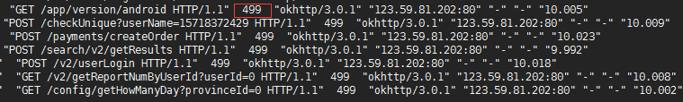
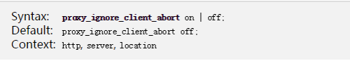
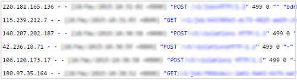
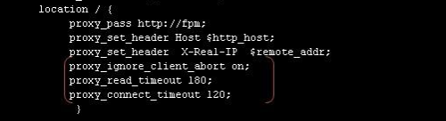
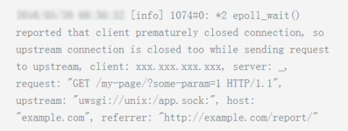
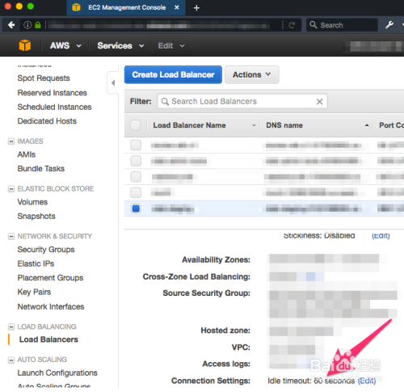

## Nginx的 HTTP 499 状态码处理

发布于 2022-07-18 17:00:49

5.4K0

举报

大家好，又见面了，我是全栈君。

**1、前言**

　　今天在处理一个客户问题，遇到Nginx access log中出现大量的499状态码。实际场景是：客户的域名通过cname解析到我们的Nginx反向代理集群上来，客户的Web服务是由一个[负载均衡](https://cloud.tencent.com/product/clb?from_column=20065&from=20065)提供外网IP进行访问，负载均衡后面挂了多个内网web站点业务[服务器](https://cloud.tencent.com/product/cvm?from_column=20065&from=20065)。出现的访问日志如下所示：

**2、处理方法**

  　 499错误是什么？让我们看看NGINX的源码中的定义： 　　ngx_string(ngx_http_error_495_page), /* 495, https certificate error */ 　　ngx_string(ngx_http_error_496_page), /* 496, https no certificate */ 　　ngx_string(ngx_http_error_497_page), /* 497, http to https */ 　　ngx_string(ngx_http_error_404_page), /* 498, canceled */ 　　ngx_null_string,                    /* 499, client has closed connection */

​     　可以看到，499对应的是 “client has closed connection”。这很有可能是**因为服务器端处理的时间过长，客户端“不耐烦”了**。

​        测试nginx发现如果两次提交post过快就会出现499的情况，看来是nginx认为是不安全的连接，主动拒绝了客户端的连接.

​       在google上搜索到一英文论坛上有关于此错误的解决方法：       proxy_ignore_client_abort on;       Don’t know if this is safe.       就是说要配置参数 proxy_ignore_client_abort on;       表示代理服务端不要主要主动关闭客户端连接。

​       以此配置重启nginx,问题果然得到解决。只是安全方面稍有欠缺，但比总是出现找不到服务器好多了

 还有一种原因是 我后来测试发现 确实是客户端关闭了连接,或者说连接超时 ,**无论你设置多少超时时间多没用 原来是php进程不够用了 改善一下php进程数** 问题解决 默认测试环境才开5个子进程。

499是nginx的Web服务器软件扩展的4xx错误，只是用于记录的目的，没有实际的响应。Nginx 499代表服务端请求还未返回时客户端主动断开连接；

还有一种情况就是**有人攻击，故意消耗服务端资源**。例如我们请求一个费时的python请求，但是客户端等不了，直接把浏览器关了，就会报这个错。不算是特别需要处理的错，单独出现可以不用在意。如果**大量出现可以分析下是不是某个请求最近请求时间异常高，适当优化**

1.  1proxy_ignore_client_abort设置步骤 **proxy_ignore_client_abort的含义**。确定在客户端关闭连接时是否应关闭与代理服务器的连接，而不在等待响应。 

1.  2 **默认 proxy_ignore_client_abort 是关闭的**。此时在请求过程中如果客户端主动关闭请求、客户端网络断开，那么 Nginx 会记录 499。 

1.  3 **如果使用了proxy_ignore_client_abort on。**那么客户端主动断掉连接之后，Nginx 会等待后端服务器处理完(或者超时)，然后记录“后端的返回信息”到日志。因此，如果后端返回200，就记录200 ；如果后端返回5XX ，那么就记录 5XX。如果超时(默认60s，可以用 proxy_read_timeout 和proxy_send_timeout设置)，Nginx 会主动断开连接，记录504。 
2.  4 **怎么在配置增加proxy_ignore_client_abort on。**首先找到配置文件，然后打开它，找到http下的server下的location,把它加进去。配置文件路径（当你执行 nginx -t 的时候，nginx会去测试你的配置文件语法，并告诉你配置文件是否写得正确，同时也告诉了你配置文件的路径) 

1.  5 **注：不建议使用proxy_ignore_client_abort 来处理这个错误。**因为这样当有大量瞬间断开的请求时，后端会默默地全部处理，比较浪费资源，而且并发压力比较大时，用这种方法将压垮机器。**这个事情交给 php-fpm 自己来处理其实挺合适。因为 PHP 默认当用户断开请求了会中断请求，如果不想自动中断请求，使用 ignore_user_abort() 就好了。** 

## 方法/步骤2：

1.    **尽管NGINX配置了，但60秒后HTTP499错误。**Nginx上的超时都设置了很大的值（远远超过60秒）。这可能是[云服务器](https://cloud.tencent.com/product/cvm?from_column=20065&from=20065)设置问题，以AWS为例。如果部署在AWS上时，60秒后连接不断被丢弃，Nginx访问日志中是499。当将错误日志设置为调试模式时，您将看到类似下面的内容。 不清楚为什么客户端删除连接。 

1.    **解决方案。**在AWS上有一个负载均衡器（load balancer），你大部分都用了默认的配置，因此它将在60秒后删除连接。将其更改去配合您的Nginx配置。 

发布者：全栈程序员栈长，转载请注明出处：https://javaforall.cn/111705.html原文链接：https://javaforall.cn

本文参与 [腾讯云自媒体分享计划](https://cloud.tencent.com/developer/support-plan)，分享自作者个人站点/博客。

原始发表：2022年2月1，如有侵权请联系 [cloudcommunity@tencent.com](mailto:cloudcommunity@tencent.com) 删除

前往查看

[nginx](https://cloud.tencent.com/developer/tag/10315)

[https](https://cloud.tencent.com/developer/tag/10813)

[网络安全](https://cloud.tencent.com/developer/tag/10681)

[php](https://cloud.tencent.com/developer/tag/10167)

[负载均衡](https://cloud.tencent.com/developer/tag/117)